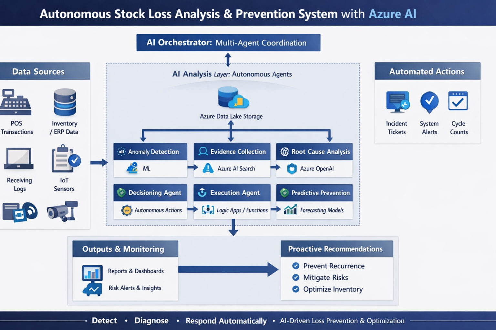

# Automated Stock Loss Evaluation

This repository packages a multi-agent stock loss investigation workflow as a runnable demo for Azure AI Foundry.

It now includes four working layers:

- source prompts for each agent role,
- Foundry agent definition templates,
- a live mock API backed by synthetic retail scenarios, and
- evaluation scripts for validating API behavior and scoring Foundry outputs.



## Current Scope

The workflow follows a closed-loop pattern:

Detection -> Evidence -> Root Cause -> Decision -> Execution -> Prevention

The repo is not just a design package anymore. The current state supports local API testing, Foundry asset bundling, scenario-based demo runs, and offline result scoring.

## What Is In The Repo

- `prompts/`: Source prompt files for the orchestrator and specialist agents, plus a design summary.
- `foundry/`: Azure AI Foundry agent definition templates and the import runbook.
- `demo/`: Synthetic stock loss scenarios, expected outcomes, and sample Foundry results.
- `openapi/`: OpenAPI contracts used to wire the agents to live or mock tools.
- `mock-api/`: Local FastAPI entrypoint and Azure Functions deployment notes.
- `stockloss_demo_api/`: Shared FastAPI application used by both local hosting and Azure Functions.
- `scripts/`: Utility scripts to build Foundry-ready assets and evaluate runs.
- `function_app.py`, `host.json`, `requirements.txt`: Azure Functions host wrapper for the shared demo API.
- `img/`: Architecture visuals.

## Agent Workflow

The prompt and Foundry assets cover these roles:

- `01-orchestrator-agent.md` / `orchestrator.agent.json`: Coordinates the investigation and downstream routing.
- `02-anomaly-detection-agent.md` / `anomaly-detection.agent.json`: Detects discrepancy patterns from inventory signals.
- `04-evidence-collection-agent.md` / `evidence-collector.agent.json`: Retrieves and normalizes supporting records.
- `03-root-cause-analysis-agent.md` / `root-cause.agent.json`: Produces ranked root cause hypotheses.
- `05-decisioning-agent.md` / `decisioning.agent.json`: Chooses auto-execution, partial automation, or escalation.
- `06-execution-agent.md` / `execution.agent.json`: Triggers approved downstream actions.
- `07-preventative-intelligence-agent.md` / `prevention.agent.json`: Recommends preventative controls for recurring patterns.

See `prompts/README.md` and `foundry/README.md` for folder-level details.

## Demo Assets

The demo currently ships with three synthetic scenarios in `demo/scenarios/stock-loss-scenarios.json` and validation targets in `demo/evaluations/expected-outcomes.md`.

Recommended first run order:

1. `store-201-pos-decrement-failure`
2. `store-118-receiving-gap`
3. `store-044-recurring-shrink-pattern`

The first scenario is the cleanest end-to-end path because it should produce a high-confidence root cause and a low-risk automated action plan.

## Run The Mock API Locally

Install the local API dependencies and start the FastAPI app:

```powershell
pip install -r mock-api/requirements.txt
uvicorn stockloss_demo_api.app:app --reload --port 8000
```

Available demo endpoints include:

- `GET /health`
- `GET /signals/scenarios`
- `GET /signals/scenarios/{scenarioId}`
- `GET /evidence/scenarios/{scenarioId}`
- `GET /policy/decision-thresholds`
- `GET /policy/actions/{scenarioId}`
- `POST /automation/actions`
- `GET /forecast/scenarios/{scenarioId}/features`

The API reads scenarios from `demo/scenarios/stock-loss-scenarios.json` by default. Override that path with the `STOCKLOSS_SCENARIO_PATH` environment variable if needed.

## Build Foundry-Ready Assets

The checked-in agent JSON files are source templates. To inline the OpenAPI specs and replace placeholder environment values, run:

```powershell
python scripts/build_foundry_assets.py --model-deployment <MODEL_DEPLOYMENT> --vector-store-id <VECTOR_STORE_ID> --api-base-url http://localhost:8000
```

This generates deployable files in `foundry/dist/` and writes `import-manifest.json` with the generated values and recommended import order.

For the import workflow, use `foundry/import-runbook.md`.

## Evaluate The Demo

Validate the live API:

```powershell
python scripts/evaluate_demo.py --api-base-url http://127.0.0.1:8000 --exercise-actions
```

Score captured Foundry outputs:

```powershell
python scripts/evaluate_demo.py --results-file demo/evaluations/sample-foundry-results.json
```

Run both together:

```powershell
python scripts/evaluate_demo.py --api-base-url http://127.0.0.1:8000 --results-file demo/evaluations/sample-foundry-results.json --exercise-actions
```

See `demo/evaluations/README.md` for expected result shapes and scoring rules.

## Azure Functions Path

The same shared FastAPI app can be hosted on Azure Functions through `function_app.py`.

Install the Functions dependencies from the repo root:

```powershell
pip install -r requirements.txt
```

Deployment guidance is in `mock-api/azure-functions.md`.

## Operating Model

- Use enterprise signals only: POS, ERP, WMS, logs, receipts, and related operational data.
- Keep actions auditable and reversible.
- Avoid direct financial adjustments.
- Escalate to a human when confidence does not justify autonomy.

## Objective

Replace manual reconciliation with an auditable, confidence-based inventory intelligence workflow for retail stock loss evaluation.
